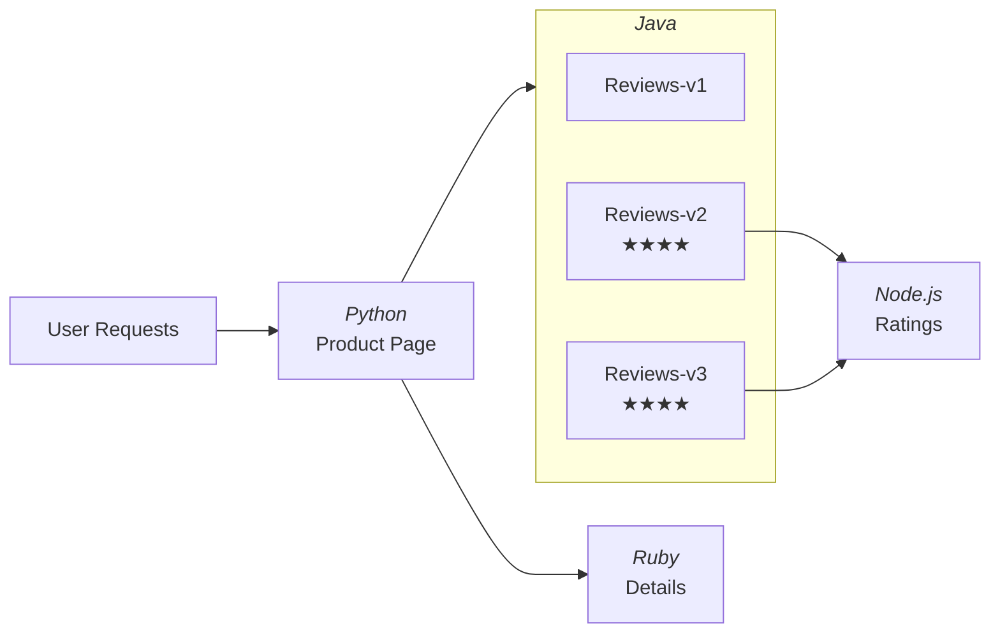

# Istio - Service Mesh

## Table of Contents
- [What is a Service Mesh?](#what-is-a-service-mesh)
- [East-West vs North-South Traffic](#east-west-vs-north-south-traffic)
- [Why Use a Service Mesh?](#why-use-a-service-mesh)
- [How Istio Works - Sidecar Injection](#how-istio-works---sidecar-injection)
- [Admission Controllers](#admission-controllers)
- [Dynamic Admission Control (Webhooks)](#dynamic-admission-control-webhooks)
- [Installing Istio](#installing-istio)
- [BookInfo Demo Application](#bookinfo-demo-application)
- [Mutual TLS (mTLS)](#mutual-tls-mtls)
- [Traffic Management - Canary Deployment](#traffic-management---canary-deployment)
- [Virtual Services and Destination Rules](#virtual-services-and-destination-rules)
- [Observability with Kiali](#observability-with-kiali)

---

## What is a Service Mesh?

A **service mesh** helps you with the **traffic management** of your Kubernetes cluster - specifically the **east-west traffic** (internal service-to-service communication).

---

## East-West vs North-South Traffic

Using a simple e-commerce app with 4 microservices: `login → catalog → payments → notifications`

| Traffic Type | Description | Example |
|---|---|---|
| **North-South** | Traffic coming from outside the cluster (Ingress/Egress) | User accessing login via Ingress |
| **East-West** | Internal service-to-service communication | catalog talking to payments |

- **Ingress** is needed to expose `login` to external users.
- Internal communication (catalog → payments, payments → notifications) is **east-west traffic**.

---

## Why Use a Service Mesh?

Services can already talk to each other within a cluster, but Istio **enhances** that communication with:

### 1. Mutual TLS (mTLS)
- Secures service-to-service communication.
- Each service gets a **certificate** issued by Istio's CA.
- Both services display certificates to each other before communicating.
- **mTLS vs Traditional TLS**: Traditional TLS = client shows cert to server. mTLS = both sides show certs to each other.

### 2. Advanced Deployment Strategies
- **Canary**: Send 10% traffic to new version, gradually increase.
- **A/B Testing**
- **Blue/Green Deployment**
- Implementing these natively in Kubernetes requires many manual changes; Istio simplifies this significantly.

### 3. Observability
- Istio ships with **Kiali** (enable when needed).
- Tracks service-to-service communication metrics automatically.
- No need to install a separate observability platform.

### 4. Other Features
- Circuit Breaking
- Traffic Splitting
- Request Timeouts

---

## How Istio Works - Sidecar Injection

Istio adds a **sidecar container** (running **Envoy proxy**) to every pod in the enabled namespaces.

```
Pod
├── Actual Container (your app)
└── Sidecar Container (Envoy proxy)
```

### Traffic Flow (Without Istio)
```
catalog → payments (direct API call)
```

### Traffic Flow (With Istio)
```
catalog → [sidecar intercepts] → [mTLS handshake] → [sidecar in payments pod] → payments
```

### What the Sidecar Handles
- **All inbound and outbound traffic** is intercepted.
- **mTLS**: Sidecar adds/verifies certificates transparently - no app code changes needed.
- **Canary routing**: Sidecar follows rules from VirtualService/DestinationRule.
- **Circuit breaking**: Handled at the sidecar level.
- **Observability**: Sidecar reports all traffic info to **Istiod** (Istio's control plane).

> Key insight: Istio adds all these features WITHOUT modifying your application code.

---

## Admission Controllers

Admission controllers **intercept requests to the API server** before objects are persisted to etcd.

### Request Flow to API Server
```
User (kubectl apply) → API Server → [Authentication & Authorization] → [Admission Controllers] → etcd
```

### Two Types
| Type | Description |
|---|---|
| **Mutating** | Can modify (mutate) the object before it's stored |
| **Validating** | Can validate/reject the object |

### Built-in Admission Controllers (30+)
Pre-compiled into the API server. Enable/disable via `kube-apiserver.yaml`:
```
cat /etc/kubernetes/manifests/kube-apiserver.yaml

--enable-admission-plugins=...
```

### Examples

**Mutation Example - DefaultStorageClass**
- Create a PVC without specifying `storageClass`.
- The `DefaultStorageClass` admission controller **mutates** the object and adds `storageClass: standard` automatically.

```bash
kubectl apply -f mutation/mutation-storage-class.yaml
kubectl edit pvc my-pvc
# You'll see storageClass: standard was added automatically
```

**Validation Example - ResourceQuota**
- Apply a quota limiting namespace to 1 CPU / 2GB RAM.
- Try to create a pod requesting 10GB RAM.
- The `ResourceQuota` admission controller **rejects** the request.

```bash
kubectl apply -f validation/validation-quota.yaml
kubectl apply -f validation/pod.yaml
# Error: exceeded quota
```

---

## Dynamic Admission Control (Webhooks)

Standard admission controllers are pre-compiled into the API server. Istio is an **external** component, so it uses **Dynamic Admission Control** (Admission Webhooks).

### Two Special Admission Controllers
- `MutatingAdmissionWebhook` controller
- `ValidatingAdmissionWebhook` controller

These controllers **do not perform mutation/validation themselves** - they **forward** requests to external webhooks.

### How Istio Sidecar Injection Works

```
Pod creation request
       ↓
API Server (Auth/Authz)
       ↓
MutatingAdmissionWebhook controller
       ↓  (reads MutatingWebhookConfiguration CR created by Istio)
Istiod Admission Webhook (in istio-system namespace)
       ↓  (injects sidecar container into the pod spec)
Returns mutated object to API Server
       ↓
etcd (pod persisted with sidecar)
```

### MutatingWebhookConfiguration CR
Istio creates this custom resource to tell the MutatingAdmissionWebhook controller:
- **When**: Forward the request whenever a pod is created.
- **Where**: Send the request to `istiod` in the `istio-system` namespace.

```bash
kubectl get mutatingwebhookconfiguration
kubectl edit mutatingwebhookconfiguration istio-sidecar-injector
# Look for: rules (when to intercept) and service (where to forward)
```

### Custom Webhook
You can create your own webhook by:
1. Writing a webhook server (Kubernetes controller).
2. Creating a `MutatingWebhookConfiguration` or `ValidatingWebhookConfiguration` CR.
3. Specifying in the CR when to forward requests and the webhook path/namespace.

> Reference: Kubernetes docs - "Dynamic Admission Control"

---

## Installing Istio

```bash
# Download Istio
curl -L https://istio.io/downloadIstio | sh -

# Navigate into folder
cd istio-1.x.x

# Export istioctl to PATH
export PATH=$PWD/bin:$PATH

# Istio Provide Multiple Profiles - demo, production, minimal, etc..
# Install with demo profile
istioctl install --set profile=demo -y

# Enable sidecar injection on default namespace
kubectl label namespace default istio-injection=enabled
```

### Profiles
| Profile | Use Case |
|---|---|
| `demo` | Best for learning/demo, default config values |
| `production` | Stricter values for production |
| `minimal` | Minimal control plane only |

### Components Installed
- **Istiod**: Primary control plane component - handles sidecar config, certificates, traffic rules.
- **Ingress Gateway**: Exposes services inside the mesh to external traffic.

---

## BookInfo Demo Application

A multi-microservice demo app provided by Istio.

### Architecture


### Deploy
```bash
kubectl apply -f samples/bookinfo/platform/kube/bookinfo.yaml

# Verify pods (should show 2/2 - app + sidecar)
kubectl get pods
```

### Expose via Istio Gateway
```bash
kubectl apply -f samples/bookinfo/networking/bookinfo-gateway.yaml

minikube tunnel
# Access at: http://localhost/productpage
```

### Observations
- Default round-robin load balancing rotates between reviews v1, v2, v3.
- v1 shows no ratings (not connected to ratings service).
- v2 shows black star ratings.
- v3 shows red star ratings.

---

## Mutual TLS (mTLS)

### Default Mode: Permissive
- Services can be accessed with or without mTLS.
- Direct `curl` to a service ClusterIP works.

### Enable Strict mTLS

```yaml
# mtls-mode.yaml
apiVersion: security.istio.io/v1beta1
kind: PeerAuthentication
metadata:
  name: mtls-mode
  namespace: default
spec:
  mtls:
    mode: STRICT
```

```bash
kubectl apply -f mTLS/mtls-mode.yaml
```

### Test
```bash
# After enabling STRICT mode:
minikube ssh
curl <service-cluster-ip>:9080
# Result: "connection reset by peer" - certificate required, access denied

# But internal service-to-service still works (they have valid certs)
# Browser refresh still works - productpage still loads
```

---

## Traffic Management - Canary Deployment

### Goal
Route traffic to specific versions using **VirtualService** and **DestinationRule**.

### Step 1: Route All Traffic to v1

```bash
kubectl apply -f samples/bookinfo/networking/virtual-service-all-v1.yaml

# Apply destination rule to ensure proper routing
kubectl apply -f samples/bookinfo/networking/destination-rule-all.yaml
```

Every refresh → reviews v1 (no ratings) - consistent, no randomness.

### Step 2: Canary - 50% to v1, 50% to v3

```yaml
# canary.yaml (VirtualService for reviews)
apiVersion: networking.istio.io/v1alpha3
kind: VirtualService
metadata:
  name: reviews
spec:
  hosts:
  - reviews
  http:
  - route:
    - destination:
        host: reviews
        subset: v1
      weight: 50
    - destination:
        host: reviews
        subset: v3
      weight: 50
```

```bash
kubectl apply -f traffic-shifting/canary.yaml
# Now 50% traffic → v1, 50% → v3
```

### Step 3: Full Rollout to v3

Change weights: `v1: 0, v3: 100` - all traffic goes to v3.

---

## Virtual Services and Destination Rules

### VirtualService
Defines **how** traffic is routed to a service.
- Which version/subset gets what percentage of traffic.
- Can define retries, timeouts, fault injection.

### DestinationRule
Defines the **available subsets** (versions) of a service.
- Maps subset names to pod labels (e.g., `version: v1`).

### Relationship
```
VirtualService → says "send 50% to subset v1"
DestinationRule → says "subset v1 = pods with label version=v1"
Sidecar (Envoy) → reads these rules and enforces them
```

### Example DestinationRule

```yaml
apiVersion: networking.istio.io/v1alpha3
kind: DestinationRule
metadata:
  name: reviews
spec:
  host: reviews
  subsets:
  - name: v1
    labels:
      version: v1
  - name: v2
    labels:
      version: v2
  - name: v3
    labels:
      version: v3
```

---

## Observability with Kiali

Kiali is not installed by default but comes bundled with Istio samples.

```bash
# Install Kiali and other addons
kubectl apply -f https://raw.githubusercontent.com/istio/istio/release-1.29/samples/addons/kiali.yaml

# Open Kiali dashboard
istioctl dashboard kiali
```

### What Kiali Shows
- **Service graph**: Visual map of service-to-service communication.
- **Traffic metrics**: Request rates, error rates, latency.
- **Health status**: Green/yellow/red indicators per service.
- **Distributed tracing**: (integrates with Jaeger/Zipkin)

> Sidecar containers report all traffic data to Istiod, which Kiali then visualizes.

---

## Quick Reference - Key Commands

```bash
# Check sidecar injection label
kubectl get namespace default --show-labels

# Verify sidecar is injected (look for 2/2)
kubectl get pods

# Check admission webhook
kubectl get mutatingwebhookconfiguration
kubectl edit mutatingwebhookconfiguration istio-sidecar-injector

# List Istio custom resources
kubectl get virtualservice
kubectl get destinationrule
kubectl get peerauthentication
kubectl get gateway

# Istioctl commands
istioctl install --set profile=demo -y
istioctl dashboard kiali
istioctl analyze
```